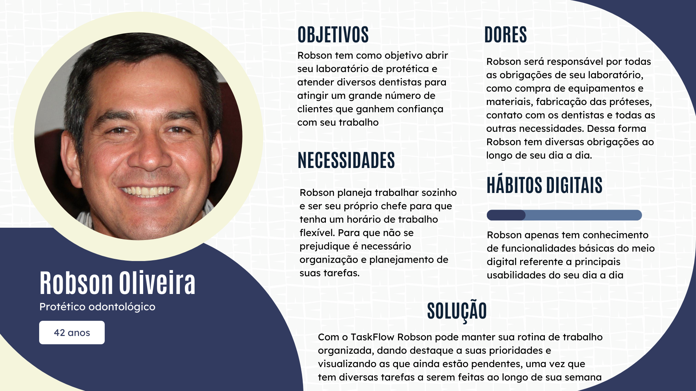
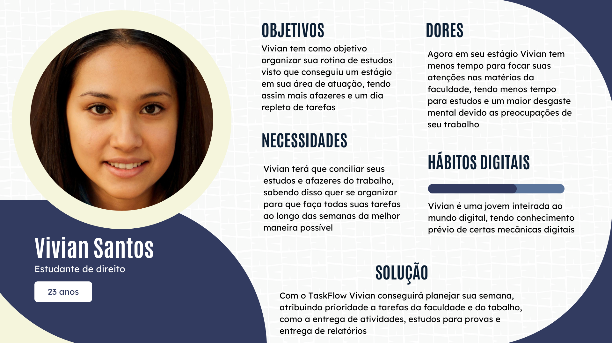

# Web Application Document - Projeto Individual - Módulo 2 - Inteli

**_Os trechos em itálico servem apenas como guia para o preenchimento da seção. Por esse motivo, não devem fazer parte da documentação final._**

## Nome do Projeto

#### Autor do projeto

## Sumário

1. [Introdução](#c1)
2. [Visão Geral da Aplicação Web](#c2)
3. [Projeto Técnico da Aplicação Web](#c3)
4. [Desenvolvimento da Aplicação Web](#c4)
5. [Referências](#c5)

 

## 1. Introdução

TaskFlow é um gerenciador de tarefas desenvolvido para ajudar os usuários a organizarem melhor seu tempo e aumentarem a produtividade, seja no contexto acadêmico ou profissional. Projetado para atender a diferentes perfis — desde estudantes até profissionais de pequenas empresas — o sistema oferece uma interface amigável, intuitiva e responsiva, acessível a todos os níveis de familiaridade com tecnologia. Seu layout foi pensado para facilitar a navegação e proporcionar uma experiência de uso fluida.

TaskFlow foi idealizado como uma solução escalável e leve, permitindo tanto o uso individual quanto colaborativo em pequenos times, com o objetivo de ser uma ferramenta útil em diferentes dispositivos e contextos. Combinando tecnologia e usabilidade, o TaskFlow propõe uma alternativa prática para quem deseja transformar suas rotinas com mais organização e clareza.

---

## 2. Visão Geral da Aplicação Web

### 2.1. Personas
Persona 1

---
Persona 2

### 2.2. User Stories

### 2.2 – User Stories

| ID    | User Story                                                                                          |
|-------|-----------------------------------------------------------------------------------------------------|
| US01  | Como estudante universitária, quero atribuir níveis de prioridade às minhas tarefas, para que eu consiga organizar melhor meu tempo entre faculdade e estágio.                          |
| US02  | Como profissional autônomo, quero visualizar todas as minhas tarefas na ordem semanal, para que eu possa planejar minha rotina de forma mais eficiente.                                   |
| US03  | Como profissional autônomo, quero atribuir categorias às minhas tarefa, para poder separa-las em suas respectivas áreas.                          |
| US04  | Como usuário do sistema, quero vizualizar prazos importantes ao entrar na plataforma, para que eu não perca datas de entrega ou compromissos.                                            |

### Análise INVEST – US01

| Critério      | Justificativa                                                                                                                                   |
|---------------|-------------------------------------------------------------------------------------------------------------------------------------------------|
| **I – Independente** | A funcionalidade de atribuir prioridade pode ser desenvolvida de maneira independente, sem depender de outras features como categorias ou organização cronológica.   |
| **N – Negociável**   | A forma de priorização (por cores, níveis, tags etc.) pode ser ajustada conforme as necessidades do projeto e feedback dos usuários.         |
| **V – Valiosa**      | Entrega valor direto ao usuário, permitindo melhor gestão do tempo e definição de foco nas atividades mais importantes.                      |
| **E – Estimável**    | É possível estimar com clareza o esforço necessário para implementá-la, com base na lógica e interface envolvidas.                           |
| **S – Pequena**      | A implementação pode ser dividida em partes menores como: criação do campo de prioridade, lógica de ordenação e exibição no front-end.                      |
| **T – Testável**     | Pode ser testada verificando se os níveis de prioridade são atribuídos corretamente e afetam a visualização e organização das tarefas.       |

---

## 3. Projeto da Aplicação Web

### 3.1. Modelagem do banco de dados (Semana 3)

_Posicione aqui os diagramas de modelos relacionais do seu banco de dados, apresentando todos os esquemas de tabelas e suas relações. Utilize texto para complementar suas explicações, se necessário._

_Posicione também o modelo físico com o Schema do BD (arquivo .sql)_

### 3.1.1 BD e Models (Semana 5)

_Descreva aqui os Models implementados no sistema web_

### 3.2. Arquitetura (Semana 5)

_Posicione aqui o diagrama de arquitetura da sua solução de aplicação web. Atualize sempre que necessário._

**Instruções para criação do diagrama de arquitetura**

- **Model**: A camada que lida com a lógica de negócios e interage com o banco de dados.
- **View**: A camada responsável pela interface de usuário.
- **Controller**: A camada que recebe as requisições, processa as ações e atualiza o modelo e a visualização.

_Adicione as setas e explicações sobre como os dados fluem entre o Model, Controller e View._

### 3.3. Wireframes (Semana 03)

_Posicione aqui as imagens do wireframe construído para sua solução e, opcionalmente, o link para acesso (mantenha o link sempre público para visualização)._

### 3.4. Guia de estilos (Semana 05)

_Descreva aqui orientações gerais para o leitor sobre como utilizar os componentes do guia de estilos de sua solução._

### 3.5. Protótipo de alta fidelidade (Semana 05)

_Posicione aqui algumas imagens demonstrativas de seu protótipo de alta fidelidade e o link para acesso ao protótipo completo (mantenha o link sempre público para visualização)._

### 3.6. WebAPI e endpoints (Semana 05)

_Utilize um link para outra página de documentação contendo a descrição completa de cada endpoint. Ou descreva aqui cada endpoint criado para seu sistema._

### 3.7 Interface e Navegação (Semana 07)

_Descreva e ilustre aqui o desenvolvimento do frontend do sistema web, explicando brevemente o que foi entregue em termos de código e sistema. Utilize prints de tela para ilustrar._

---

## 4. Desenvolvimento da Aplicação Web (Semana 8)

### 4.1 Demonstração do Sistema Web (Semana 8)

_VIDEO: Insira o link do vídeo demonstrativo nesta seção_
_Descreva e ilustre aqui o desenvolvimento do sistema web completo, explicando brevemente o que foi entregue em termos de código e sistema. Utilize prints de tela para ilustrar._

### 4.2 Conclusões e Trabalhos Futuros (Semana 8)

_Indique pontos fortes e pontos a melhorar de maneira geral._
_Relacione também quaisquer outras ideias que você tenha para melhorias futuras._

## 5. Referências

_Incluir as principais referências de seu projeto, para que seu parceiro possa consultar caso ele se interessar em aprofundar. Um exemplo de referência de livro e de site:_ 

---

---
